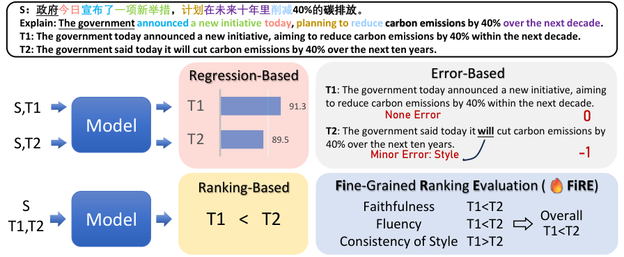
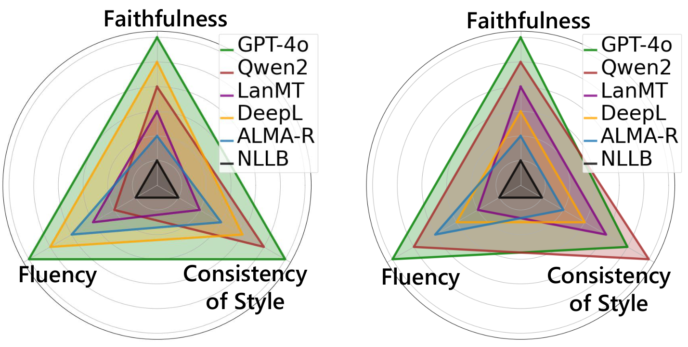

<h1 align="center">
    FiRE: Fine-grained Ranking Evaluation for Machine Translation

</h1>
<p align="center">
  
  
  
</p>

<p align="center">
  <a href="https://scholar.google.com/citations?user=R_GmxIAAAAAJ">Wenyang Gao</a>*¹²,
  <a href="https://rockyyh.github.io/">Yinghao Yang</a>*²,
  <a href="https://github.com/jandx20031231">Xi Jin</a>¹,
  Jing Li³,
  <a href="https://frcchang.github.io/">Yue Zhang</a>²
</p>
<p align="center">
  ¹ Zhejiang University &nbsp;|&nbsp; ² School of Engineering, Westlake University &nbsp;|&nbsp; ³ Sichuan Lan-bridge Information Technology Co., Ltd.
</p>
<p align="center"><em>* Equal contribution</em></p>

<p align="center">
  <b>A reference-free, criterion-driven pairwise evaluation framework for machine translation.</b>
</p>

## Introduction

<p align="center">
  
  <br>
  <em> Illustrative case of regression-based, error-based, ranking-based evaluation, and our proposed fine-grained ranking evaluation (FiRE). </em>
</p>

Reliable evaluation is central to the development of high-quality machine translation (MT) systems. As modern MT systems and large language models increasingly produce fluent and competitive translations, traditional automatic metrics often become less effective at distinguishing subtle quality differences. Overlap-based metrics such as BLEU provide limited semantic sensitivity, while regression-based metrics produce scalar scores that may obscure fine-grained trade-offs between translations. Error-based methods offer richer diagnostic information, but their aggregated scores are not directly optimized for pairwise preference evaluation.

**FiRE** addresses this gap by formulating machine translation evaluation as a **fine-grained, reference-free pairwise ranking** problem. Given a source sentence and two translation candidates, FiRE asks an evaluator to compare the candidates under explicit criteria, including:

- **Faithfulness**: whether the translation accurately preserves the source meaning;
- **Fluency**: whether the translation is natural, readable, and grammatically well-formed;
- **Consistency of Style**: whether the translation preserves the tone, register, and stylistic characteristics of the source;
- **Overall Quality**: a synthesized or directly judged holistic preference.

Instead of relying on a single overall judgment, FiRE decomposes translation quality into complementary dimensions and then aggregates criterion-level judgments into an overall decision. This design improves interpretability, provides more actionable diagnostic signals, and better reflects the multi-dimensional nature of human translation preferences.

The repository provides code for running FiRE-style evaluation with either API-based LLM evaluators or local vLLM-backed models, together with human-annotated benchmark data and scripts for evaluation and scoring.

## Some Main Findings

The paper reports several key findings:

- **Fine-grained pairwise evaluation improves alignment with human preferences.**FiRE consistently outperforms error-based evaluation methods across faithfulness, fluency, and consistency of style on ranked pairwise data.
https://rockyyh.github.io/
<table>
  <caption><em>Percentage agreement (%) between model evaluators and human annotations on ranked pairwise data. <b>Bold</b>  indicates the best performance per criterion and language direction.</em></caption>
  <thead>
    <tr>
      <th></th>
      <th colspan="3" align="center">EN→ZH</th>
      <th colspan="3" align="center">RU→ZH</th>
    </tr>
    <tr>
      <th></th>
      <th>Faithfulness</th><th>Fluency</th><th>Cons. of Style</th>
      <th>Faithfulness</th><th>Fluency</th><th>Cons. of Style</th>
    </tr>
  </thead>
  <tbody>
    <tr><td colspan="7"><em>Error-Based</em></td></tr>
    <tr><td>M-MAD</td><td>45.9</td><td>25.2</td><td>19.3</td><td>55.4</td><td>24.9</td><td>17.5</td></tr>
    <tr><td>GEMBA-MQM</td><td>37.9</td><td>32.9</td><td>3.0</td><td>39.8</td><td>29.9</td><td>5.4</td></tr>
    <tr><td colspan="7"><em>Ranking-Based</em></td></tr>
    <tr><td>DeepSeek-R1-FiRE</td><td><b>64.8</b></td><td><b>68.7</b></td><td><b>61.4</b></td><td><b>72.5</b></td><td><b>77.9</b></td><td><b>66.3</b></td></tr>
  </tbody>
</table>

- **Criterion-aware aggregation improves overall ranking.**Aggregating fine-grained judgments from faithfulness, fluency, and consistency of style yields stronger overall pairwise decisions than direct holistic ranking in several settings.

<table>
  <caption><em>Percentage agreement (%) between model evaluators and human annotations on ranked overall pairwise data. <b>Bold</b> indicates the best performance per language direction.</em></caption>
  <thead>
    <tr>
      <th></th>
      <th>EN→ZH</th>
      <th>RU→ZH</th>
    </tr>
  </thead>
  <tbody>
    <tr><td colspan="3"><em>Regression-Based</em></td></tr>
    <tr><td>KIWI-XXL</td><td>61.4</td><td>61.2</td></tr>
    <tr><td>XCOMET-XXL</td><td>55.7</td><td>58.0</td></tr>
    <tr><td>MetricX-24-XXL</td><td>61.6</td><td>67.1</td></tr>
    <tr><td colspan="3"><em>Error-Based</em></td></tr>
    <tr><td>M-MAD</td><td>43.6</td><td>51.9</td></tr>
    <tr><td>GEMBA-MQM</td><td>41.5</td><td>37.6</td></tr>
    <tr><td colspan="3"><em>Ranking-Based</em></td></tr>
    <tr><td>Ranker-XXL</td><td>60.7</td><td>61.6</td></tr>
    <tr><td>DeepSeek-R1-Direct-Rank</td><td>64.3</td><td>66.7</td></tr>
    <tr><td>DeepSeek-R1-FiRE</td><td><b>65.3</b></td><td><b>70.1</b></td></tr>
  </tbody>
</table>
- **FiRE provides interpretable system-level diagnosis.**Beyond producing an overall ranking, FiRE reveals where MT systems gain or lose performance across different quality dimensions.

<p align="center">
  
  <br>
  <em>Fine-grained ranking of six MT systems based on all pairwise data in EN→ZH (left) and RU→ZH (right).</em>
</p>

## Quick Start

### Step 1. Install Dependencies

We recommend using a clean Python environment.

```bash
python -m venv .venv
source .venv/bin/activate
```

Or with conda:

```bash
conda create -n fire python=3.12
conda activate fire
```

Install the required dependencies:

```bash
pip install -r requirements.txt
```

If you are using a mirror source, for example the Tsinghua PyPI mirror, you can run:

```bash
pip install -r requirements.txt -i https://pypi.tuna.tsinghua.edu.cn/simple
```

### Step 2. Run FiRE in API Mode

Use `--mode api` when calling an OpenAI-compatible API endpoint.

```bash
python run.py \
    --src-language English \
    --tgt-language Chinese \
    --dataset tied \
    --mode api \
    --model-name Qwen/Qwen3.6-35B-A3B \
    --api-key sk-**** \
    --api-url https://***/v1
```

### Step 3. Run FiRE in vLLM Mode

Use `--mode vllm` when running a local model through vLLM.

Before running vLLM mode, install vLLM separately:

```bash
pip install vllm
```

Then run:

```bash
python run.py \
    --src-language Russian \
    --tgt-language Chinese \
    --dataset tied \
    --mode vllm \
    --model-name QwQ-32B \
    --model-path path-to-model
```

### Dataset Options

The `--dataset` argument controls which subset of the benchmark is evaluated:

| Option     | Meaning                                                               |
| ---------- | --------------------------------------------------------------------- |
| `tied`   | Tie cases where human annotators judge two translations as equivalent |
| `ranked` | Distinguishable cases where one translation is preferred              |
| `all`    | All evaluation cases                                                  |

### Main Arguments

| Argument           | Description                                                       |
| ------------------ | ----------------------------------------------------------------- |
| `--src-language` | Source language name, e.g.,`English`, `Russian`, `Japanese` |
| `--tgt-language` | Target language name, e.g.,`Chinese`                            |
| `--dataset`      | Evaluation split:`all`, `ranked`, or `tied`                 |
| `--mode`         | Evaluation backend:`api` or `vllm`                            |
| `--model-name`   | Model name used for API calls and output organization             |
| `--api-key`      | API key for API mode                                              |
| `--api-url`      | Base URL for an OpenAI-compatible API endpoint                    |
| `--model-path`   | Local model path for vLLM mode                                    |
| `--preferences`  | Evaluation criteria; defaults to all supported preferences        |
| `--temperature`  | Sampling temperature for LLM generation                           |

Example with selected preferences:

```bash
python run.py \
    --src-language English \
    --tgt-language Chinese \
    --dataset ranked \
    --mode api \
    --model-name your-model-name \
    --api-key sk-**** \
    --api-url https://***/v1 \
    --preferences Faithfulness Fluency Overall \
    --temperature 0.6
```

## Repository Structure

```text
.
├── annotation/
│   ├── en-zh/
│   │   ├── en-zh-annotation.json
│   │   ├── en-zh-annotation-all.json
│   │   ├── en-zh-annotation-ranked.json
│   │   └── en-zh-annotation-tied.json
│   ├── ja-zh/
│   ├── ru-zh/
│   └── ...
│
├── outputs/
│
├── scripts/
│   ├── extract.py
│   ├── fire_eval.py
│   ├── get_vllm.py
│   ├── prompt.py
│   └── scripts.py
│
├── run.py
├── requirements.txt
└── README.md
```

### Directory and File Descriptions

- `annotation/`Human annotations and benchmark data organized by language pair. Each language-pair directory contains the full annotation file and split files for `all`, `ranked`, and `tied` cases.
- `outputs/`Generated evaluation outputs. Model predictions and scoring results are saved here during evaluation.
- `scripts/extract.py`Utility script for extracting and splitting annotation data into different subsets.
- `scripts/fire_eval.py`Core FiRE evaluation logic, including dataset loading, API/vLLM querying, result caching, aggregation, and scoring.
- `scripts/get_vllm.py`vLLM wrapper for loading local models and generating batched responses.
- `scripts/prompt.py`Prompt templates and parsing utilities for criterion-based pairwise evaluation.
- `scripts/scripts.py`Additional evaluation utilities.
- `run.py`Main command-line entry point for running FiRE evaluation.
- `requirements.txt`
  Python dependencies required for running the repository.

## Output Format

Running `run.py` will evaluate the selected dataset split and save model outputs under `outputs/`.

A typical output entry contains:

- source sentence;
- translation A and translation B;
- predicted preference label;
- human gold label;
- model output content;
- optional reasoning content, if returned by the evaluator.

The preference labels are:

| Label | Meaning                                        |
| ----- | ---------------------------------------------- |
| `A` | Translation A is better                        |
| `B` | Translation B is better                        |
| `E` | Translation A and Translation B are equivalent |

## Contact

For questions, please contact:

```text
gaowenyang@westlake.edu.cn
```
